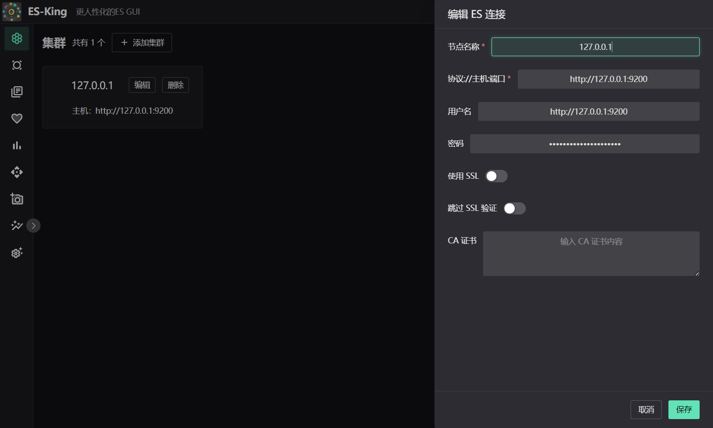
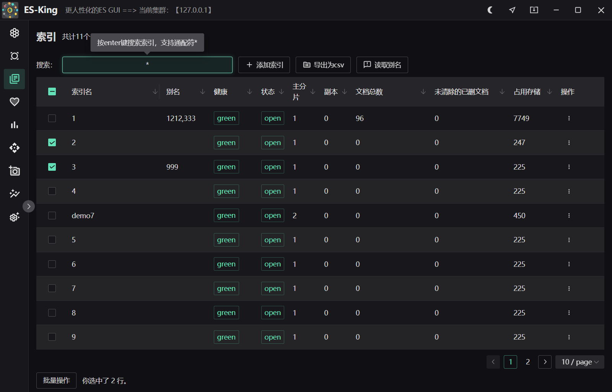

<div align=center></div>
<h1 align="center">ES-King </h1>

<div align="center">


<strong>一个现代、实用的ES GUI客户端，支持多平台。</strong>


</div>



多种配色可选，例如猛男粉:


同款已经开发好的Kafka客户端，已有一千多人下载：[Kafka-King](https://github.com/Bronya0/Kafka-King)

如需提出需求、bug和改进建议，请提issue。

点个star支持作者辛苦开源吧 谢谢❤❤

加群和作者一起交流： <a target="_blank" href="https://qm.qq.com/cgi-bin/qm/qr?k=pDqlVFyLMYEEw8DPJlRSBN27lF8qHV2v&jump_from=webapi&authKey=Wle/K0ARM1YQWlpn6vvfiZuMedy2tT9BI73mUvXVvCuktvi0fNfmNR19Jhyrf2Nz">研发技术交流群：964440643</a>


# 下载
[下载地址](https://github.com/Bronya0/ES-King/releases)，点击【Assets】，选择自己的平台下载，支持windows、macos、linux。


# 构建
```
pip install -r requirements.txt
运行 main.py
或
flet pack main.py -i assets/icon.ico -n ES-king --add-data=assets/*:assets --product-name ES-king
```

# 星
[](https://starchart.cc/Bronya0/ES-King)


# 感谢
- flet-dev：https://github.com/flet-dev/flet
