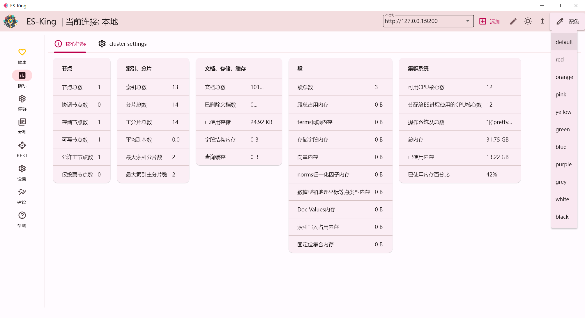
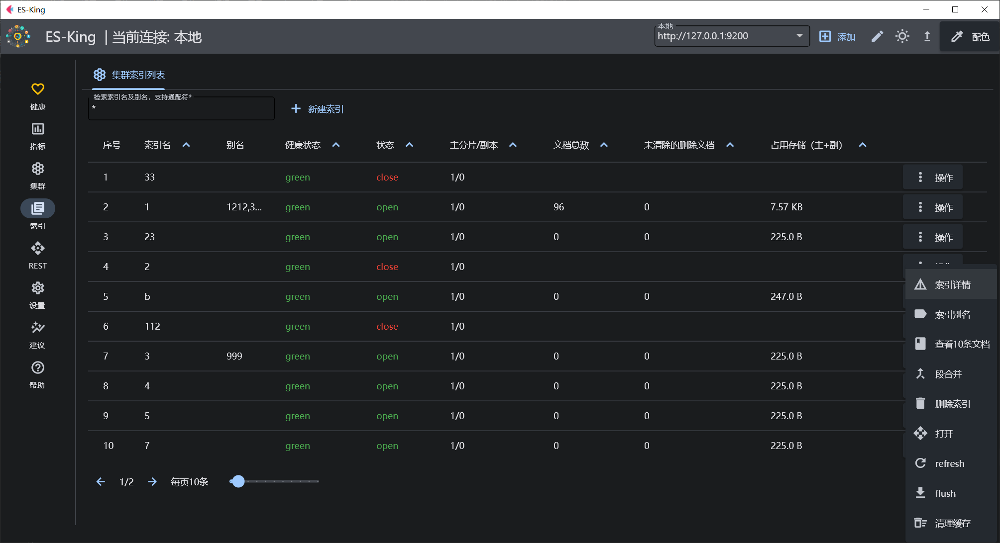
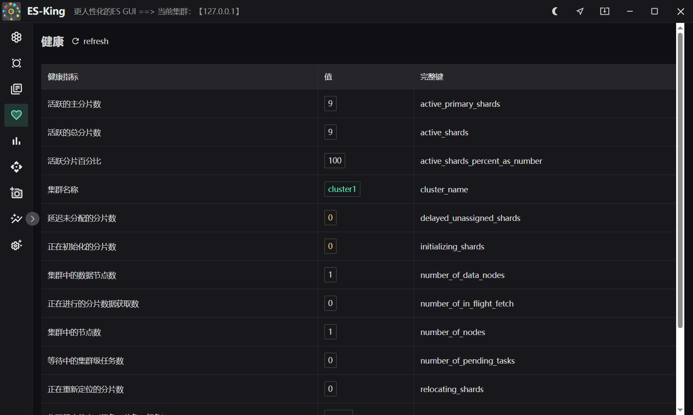
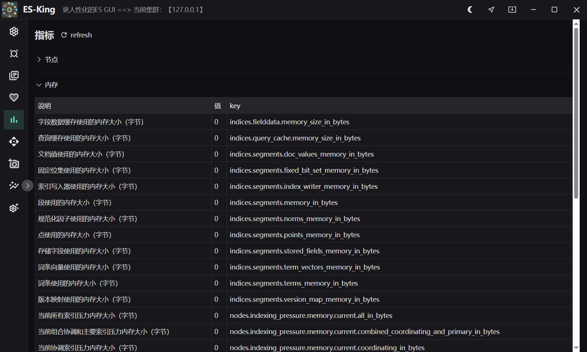
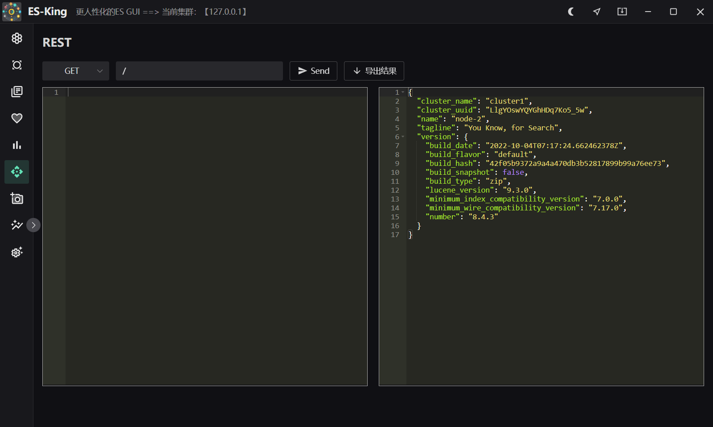

<h1 align="center">ES-King </h1>
<h4 align="center"><strong>简体中文</strong> | <a href="https://github.com/Bronya0/ES-King/blob/wails/readme-en.md">English</a></h4>

<div align="center">


<strong>A modern, practical, lightweight ES GUI client that supports multiple platforms and the installation package is less than 10mb. </strong>

</div>

Making Elasticsearch easier to use — make ES great again!

This desktop software is designed for querying, administering, and operating Elasticsearch clusters across major desktop platforms (Windows, macOS, Linux). It communicates directly via Elasticsearch REST APIs with virtually no version compatibility issues. By integrating rich cluster metrics, index operations, document management, diagnostics, and an optimized REST console, ES-King significantly enhances efficiency and productivity.

If you have feature requests, bug reports, or suggestions, feel free to open an issue.

Give a star ⭐ to support the author's hard work in open source! Thank you! ❤❤

- **Kafka Client by the same author**: [Kafka-King](https://github.com/Bronya0/Kafka-King)
- **AI Coding Assistant by the same author**: [ally-agent](https://github.com/Bronya0/ally-agent)
- **Tech Exchange QQ Group**: 964440643

# Features
- **Cluster Health & Monitoring**:
  - Detailed cluster & node statistics: node roles, heap memory usage, total memory, CPU utilization, disk storage, network I/O, and 5-minute load averages.
  - Node-level cache metrics: field data cache, segment cache, query cache, request cache, and segment counts.
  - Shard overview: active shards, initializing shards, unassigned shards, delayed shards, and active shard percentage.
- **Index Management & Operations**:
  - Index searching, alias management (supports adding with Filter/Routing and removing aliases), and batch CSV export.
  - Lifecycle maintenance: create, delete, open/close indices, Flush, Refresh, Clear Cache, and Force Merge segments.
  - Online Mapping and Settings inspection and dynamic updates.
  - Data Migration: Reindex data asynchronously between indices.
  - Backup: Download and export index documents filtered by DSL directly to local JSON files.
- **Document Management (Docs)**:
  - Document search: Browse documents with pagination, custom DSL queries, field sorting, and fast keyword filtering.
  - Document operations: View, inline edit (JSON), and delete individual documents.
  - Batch operations: Delete by query (`_delete_by_query`), batch import local JSON / CSV files, and `_bulk` data ingestion.
  - Field analysis: Analyze top frequent field values and cardinality statistics.
- **Cluster Diagnostics**:
  - Shards: View cluster-wide shard allocation, status, and unassigned reasons.
  - Allocation Explain: Diagnose why a shard is unassigned or cannot be moved with official guidance.
  - Thread Pool: Real-time monitoring of thread pool activity, queue backlog, and rejection counts across nodes.
  - Hot Threads: Inspect high-CPU hot thread stack traces across cluster nodes.
  - Pending Tasks: Monitor tasks queued or blocked on the cluster master node.
- **Templates & ILM**:
  - Manage Index Templates and Component Templates (create, view, update, delete).
  - Create new indices directly based on existing templates with a single click.
  - Index Lifecycle Management (ILM): View, create, and delete ILM policies.
- **Snapshots & SLM (Snapshot Lifecycle Management)**:
  - Repository management: Create, verify, and delete snapshot repositories (`fs`, `s3`, `hdfs`, `azure`, `gcs`).
  - Snapshot operations: Take non-blocking snapshots, filter by indices, and restore snapshots (with index renaming patterns, global state restoration, and progress monitoring).
  - Automatic SLM policies: Configure Cron schedules, timestamp naming templates, and automatic retention/cleanup rules.
- **Analysis Debugger**:
  - Built-in tokenizer and analyzer testing tool to visualize token streams and attributes in real time.
- **Advanced REST Console**:
  - Multi-tab support: Open multiple query tabs simultaneously for multitasking.
  - Query bookmarks: Save frequently used DSL queries for quick reuse.
  - Table & JSON view: Toggle freely between interactive data table and hierarchical JSON tree responses.
  - Built-in DSL snippets: Insert common Elasticsearch query and administration templates with one click.
  - Full HTTP status code handling (200/201/202) and raw text response display.
- **Connection Management & Security**:
  - Card interaction feedback with hover animations and currently connected badge.
  - Connection profile import and export (with optional password inclusion and same-name merge updates).
  - Client isolation: Rebuilds HTTP client on connection switch to eliminate BasicAuth, TLS, or CA residue.
- **Full Internationalization (i18n)**:
  - Powered by vue-i18n with complete translations for Simplified Chinese (`zh-CN`), English (`en`), and Japanese (`ja`).

# Download
[Download address](https://github.com/Bronya0/ES-King/releases), click [Assets], and choose the platform of your computer to download. It supports Windows, macOS, and Linux.

# Screenshot



 

# Build 
is only needed to study the source code.
Install wails, refer to: https://wails.io/docs/gettingstarted/installation

```
cd app
wails dev
```

# Star
[](https://starchart.cc/Bronya0/ES-King)

# Thanks
- wails: https://wails.io/docs/gettingstarted/installation
- naive ui : https://www.naiveui.com/